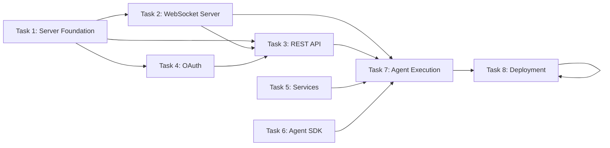

# Implementation Plan: ZTF Server-Based Architecture

**Spec:** [2026-04-02-ztf-server-based-architecture-design.md](../specs/2026-04-02-ztf-server-based-architecture-design.md)  
**Status:** APPROVED → Ready for Implementation  
**Type:** M Plan (Multi-session, One Sprint)  
**Target Task Count:** 8 tasks  
**Parallel Tasks Per Batch:** Max 4

---

## Architecture Overview

```
Server (VPS/Docker)                          Agent (Local)
┌──────────────────────────────┐            ┌─────────────────────┐
│  NestJS API Server           │            │  CLI Agent          │
│  - REST endpoints            │            │  - WebSocket Client │
│  - Job management            │            │  - Playwright       │
└───────────────┬──────────────┘            │  - LLM Generation   │
                │ WebSocket                  └─────────────────────┘
                │ (outbound)                        │
                ▼                                   ▼
┌──────────────────────────────┐    ┌────────────┴───────────────┐
│  PostgreSQL                  │    │  Google Drive              │
│  - agents, jobs, results     │    │  - Evidence storage        │
└──────────────────────────────┘    └────────────────────────────┘
                │
                ▼
┌──────────────────────────────┐
│  Google OAuth + Notion API   │
│  - User auth                 │
│  - Story sync                │
└──────────────────────────────┘
```

---

## File Mapping Table

| Action | File/Directory | Description |
|--------|---------------|-------------|
| **CREATE** | `server/` | Server project scaffold |
| **CREATE** | `server/src/main.ts` | NestJS entry point |
| **CREATE** | `server/src/app.module.ts` | Root module |
| **CREATE** | `server/src/config/` | Config service (env, secrets) |
| **CREATE** | `server/src/database/` | TypeORM setup, migrations |
| **CREATE** | `server/src/entities/` | PostgreSQL entities (Agent, Job, Result) |
| **CREATE** | `server/src/websocket/` | WebSocket server, handlers |
| **CREATE** | `server/src/api/` | REST API controllers |
| **CREATE** | `server/src/services/` | Auth, Notion, Drive services |
| **CREATE** | `server/.env.example` | Environment template |
| **CREATE** | `server/Dockerfile` | Docker image |
| **CREATE** | `server/docker-compose.yml` | Local dev setup |
| **CREATE** | `agent/` | Agent project scaffold |
| **CREATE** | `agent/src/index.ts` | CLI entry point |
| **CREATE** | `agent/src/config/` | Agent config (auto-generated) |
| **CREATE** | `agent/src/connection/` | WebSocket client |
| **CREATE** | `agent/src/test-runner/` | Playwright integration |
| **CREATE** | `agent/src/llm/` | LLM generation client |
| **CREATE** | `agent/src/evidence/` | Google Drive uploader |
| **CREATE** | `agent/.env.example` | Agent environment template |
| **CREATE** | `zie-agent/` | Shared agent SDK (npm package) |
| **CREATE** | `zie-agent/src/` | Reusable agent utilities |
| **MODIFY** | `Makefile` | Add server/agent make targets |
| **CREATE** | `.github/workflows/` | CI/CD for server build |
| **CREATE** | `docs/agent-setup.md` | Agent installation guide |

---

## TDD Implementation Tasks

### Task 1: Server Foundation — Setup NestJS + PostgreSQL

**Goal:** Server scaffolding with database connection

| Phase | Steps |
|-------|-------|
| **RED** | Write test for database connection failure (missing env) |
| **GREEN** | Create NestJS app, TypeORM config, `server/src/database/orm.config.ts`, basic entity test |
| **REFACTOR** | Extract config to service, add health check endpoint |

**Test Coverage:**
- Database connection with valid env
- Database connection with invalid env
- Entity registration (Agent, Job, Result)

**Dependencies:**
- `@nestjs/core`, `@nestjs/common`, `@nestjs/platform-ws`
- `typeorm`, `pg`, `reflect-metadata`
- `@nestjs/config`

**Output:** `server/src/app.module.ts`, `server/src/database/`

---

### Task 2: WebSocket Server — Agent Registration & Communication

**Goal:** WebSocket server handles agent registration, heartbeat, job dispatch

| Phase | Steps |
|-------|-------|
| **RED** | Test: Agent not registered → connection rejected |
| **GREEN** | Create `WebSocketGateway`, `register()` handler, generate agentId, store in DB |
| **REFACTOR** | Add heartbeat validation, connection pooling, session management |

**Test Coverage:**
- Agent registration with capabilities
- Duplicate agent ID handling (merge session)
- Heartbeat timeout (agent marked offline)
- Job available broadcast to idle agents

**Messages:**
- Agent → Server: `register`, `heartbeat`, `job_claimed`, `progress`, `result`
- Server → Agent: `registered`, `job_available`, `job_cancelled`

**Output:** `server/src/websocket/agents.gateway.ts`, `server/src/websocket/handlers/`

---

### Task 3: REST API — Job Management Endpoints

**Goal:** CRUD for jobs, agent status, project config

| Phase | Steps |
|-------|-------|
| **RED** | Test: Create job without auth → 401 |
| **GREEN** | Create `JobController`, `createJob()`, `getJobs()`, `getJobStatus()`, `updateJob()` |
| **REFACTOR** | Add DTO validation, filtering, pagination, job assignment logic |

**Endpoints:**
- `POST /jobs` — Create new job
- `GET /jobs` — List jobs (filter by status, agent)
- `GET /jobs/:id` — Get job details
- `PATCH /jobs/:id` — Update job status
- `GET /agents` — List agents with status
- `GET /projects` — List configured projects

**Output:** `server/src/api/controllers/`, `server/src/api/dtos/`

---

### Task 4: Authentication — Google OAuth Integration

**Goal:** Users authenticate via Google OAuth, sessions stored in DB

| Phase | Steps |
|-------|-------|
| **RED** | Test: Missing OAuth token → access denied |
| **GREEN** | Add OAuth flow (`/auth/google`, `/auth/callback`), store tokens, create user record |
| **REFACTOR** | Add refresh tokens, session expiry, role-based access (admin vs user) |

**Test Coverage:**
- New user creation via OAuth
- Returning user login
- Token refresh flow
- Revoked token handling

**Dependencies:**
- `google-auth-library`
- `@nestjs/jwt` (optional for session tokens)

**Output:** `server/src/services/auth.service.ts`, `server/src/auth/`

---

### Task 5: Server Services — Notion API & Google Drive

**Goal:** Sync stories from Notion, upload evidence to Google Drive

| Phase | Steps |
|-------|-------|
| **RED** | Test: Notion API failure → job marked failed |
| **GREEN** | Create `NotionService`, `DriveService` with retry logic |
| **REFACTOR** | Add batch operations, caching, error recovery |

**Test Coverage:**
- Read story from Notion database
- Update test result to Notion page
- Upload evidence to Drive
- Drive upload failure → local fallback

**Key Methods:**
- `notionService.readStory(pageId)` → Story content
- `notionService.updateResult(pageId, results)` → Sync results
- `driveService.upload(file, parentId)` → Drive file URL
- `driveService.createFolder(name)` → Evidence folder

**Output:** `server/src/services/notion.service.ts`, `server/src/services/drive.service.ts`

---

### Task 6: Agent SDK — Shared Utilities Package

**Goal:** Reusable agent code as `@zie/agent` npm package

| Phase | Steps |
|-------|-------|
| **RED** | Test: Missing config file → clear error message |
| **GREEN** | Create `agent/` with config loader, WebSocket client wrapper |
| **REFACTOR** | Extract to `zie-agent/`, add versioning, CLI command scaffolding |

**Package Structure:**
```
zie-agent/
├── src/
│   ├── config.ts       # Auto-configuration
│   ├── connection.ts   # WebSocket client (reconnect, keepalive)
│   ├── logger.ts       # Structured logging
│   └── utils.ts        # Helpers (uuid, retry, sleep)
├── package.json
└── README.md
```

**Output:** `zie-agent/` as independent package, referenced by `agent/`

---

### Task 7: Agent Execution — Playwright + LLM Test Runner

**Goal:** Agent runs Playwright tests, generates specs via LLM

| Phase | Steps |
|-------|-------|
| **RED** | Test: Test execution with invalid URL → error logged |
| **GREEN** | Create `TestRunner` class, `llmGenerateSpec()`, `runTest()` |
| **REFACTOR** | Add parallel test execution, timeout handling, screenshot capture |

**Test Coverage:**
- LLM generates spec from Notion story
- Playwright executes tests
- Evidence (screenshots) captured
- Progress streamed to server
- Results synced to Notion

**Output:** `agent/src/test-runner/`, `agent/src/llm/`

---

### Task 8: Deployment — Docker Configuration + CI/CD

**Goal:** Server runs in Docker, agent installs locally

| Phase | Steps |
|-------|-------|
| **RED** | Test: Docker build fails → clear error |
| **GREEN** | Create `Dockerfile`, `docker-compose.yml`, `.github/workflows/server.yml` |
| **REFACTOR** | Add health check, secrets management, auto-migration on startup |

**Docker Compose Services:**
- `api` — NestJS server
- `postgres` — PostgreSQL 15
- `redis` — Cache (optional, for sessions)

**CI/CD Pipeline:**
- Build server image on push
- Run tests in CI
- Deploy to VPS (SSH or GitHub Actions)

**Output:** `server/Dockerfile`, `server/docker-compose.yml`, `.github/workflows/server.yml`

---

## Task Dependencies



**Key Dependencies:**
1. Task 1 (Server Foundation) must complete before Tasks 2, 3, 4, 5
2. Task 2 (WebSocket) required for Task 7 (Agent Execution)
3. Task 5 (Services) required for Task 7 (Notion/Drive sync)
4. Task 6 (Agent SDK) reduces complexity of Task 7
5. Task 8 (Deployment) can run in parallel with Tasks 6-7

---

## Parallel Task Batches

### Batch 1 (Independent, safe to run together)
- Task 1: Server Foundation
- Task 4: Google OAuth (partial - auth framework only)
- Task 6: Agent SDK (independent package)

### Batch 2 (Requires Task 1)
- Task 2: WebSocket Server
- Task 3: REST API
- Task 5: Server Services (Notion/Drive - partial)

### Batch 3 (Requires WebSocket + Services)
- Task 7: Agent Execution
- Task 8: Deployment (Docker config)

**Max parallel: 4 tasks** —_batches respect this limit_

---

## Acceptance Criteria

### Server
- [ ] Server starts with `npm run start:dev`
- [ ] PostgreSQL connection established
- [ ] WebSocket accepts agent connections
- [ ] OAuth flow completes (user can login)
- [ ] REST API returns valid responses
- [ ] Notion story can be read
- [ ] Google Drive upload succeeds
- [ ] Docker build succeeds

### Agent
- [ ] Agent connects to server (outbound WebSocket)
- [ ] Auto-registration works
- [ ] Test execution via Playwright succeeds
- [ ] LLM generates test spec
- [ ] Evidence uploaded to Google Drive
- [ ] Results sync to Notion

### Infrastructure
- [ ] CI/CD pipeline runs on push
- [ ] Docker image builds successfully
- [ ] Health check endpoint responds
- [ ] Logs are structured and observable

---

## Risk Mitigation

| Risk | Mitigation |
|------|------------|
| WebSocket reconnection chaos | Exponential backoff, dedup connections |
| Notion API rate limiting | Retry with backoff, queue operations |
| Drive upload failures | Local fallback + retry queue |
| LLM generation timeout | Configurable timeout, graceful degradation |
| Multiple agents for same job | First-claim-wins, job locking |

---

## Rollout Strategy

1. **Phase 1 (Week 1):** Server foundation + WebSocket + REST API
2. **Phase 2 (Week 2):** Auth + Services + Agent SDK
3. **Phase 3 (Week 3):** Agent execution + Integration testing
4. **Phase 4 (Week 4):** Deployment + CI/CD + Documentation

---

## Files Summary

| Type | Count | Description |
|------|-------|-------------|
| **New Files** | ~25 | Server, Agent, SDK source files |
| **New Folders** | 8 | `server/`, `agent/`, `zie-agent/`, and subdirs |
| **Modified Files** | 1 | `Makefile` (add targets) |
| **Dependencies** | ~30 | npm packages for NestJS, TypeORM, OAuth, Playwright |

---

## Next Steps

1. Run `/zie-plan` to review and approve plan
2. Approve → Move to **Now** on ROADMAP
3. Create branch `feat/server-architecture`
4. Execute Tasks 1-8 per TDD loop (RED → GREEN → REFACTOR)
5. Run `/zie-verify` before PR
6. Merge to `main`, deploy to VPS

---

*Plan generated: 2026-04-02*  
*Author: Phoo Pha*  
*Approved by: Zie (pending)*
